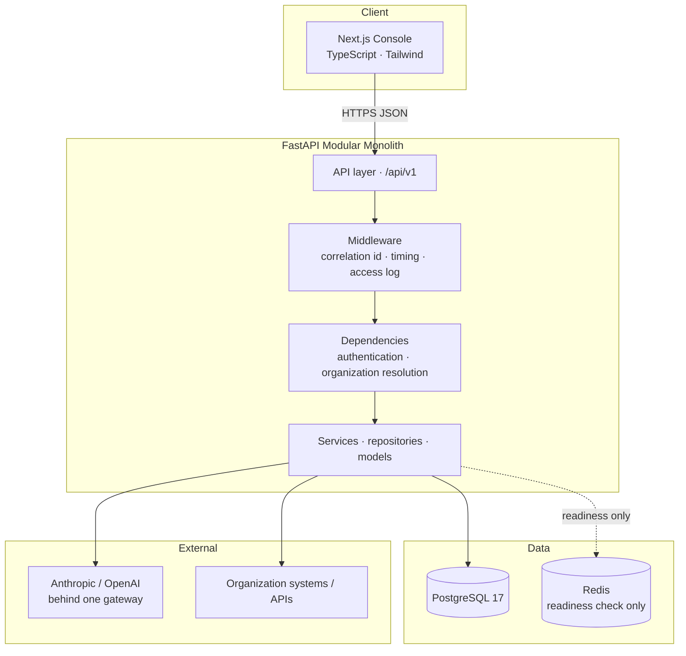
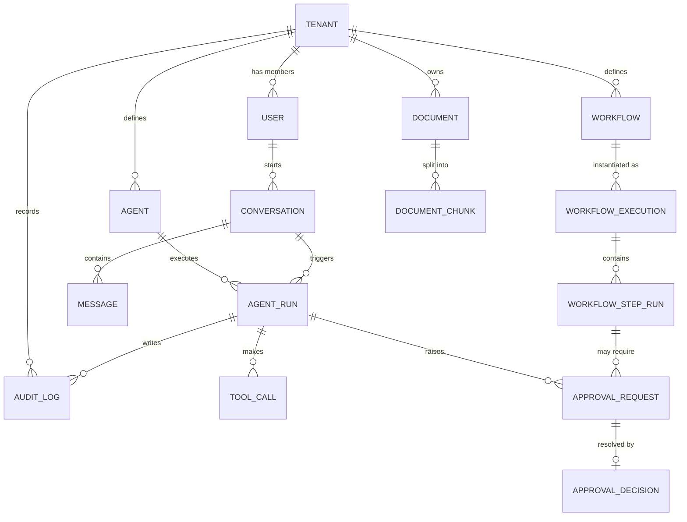
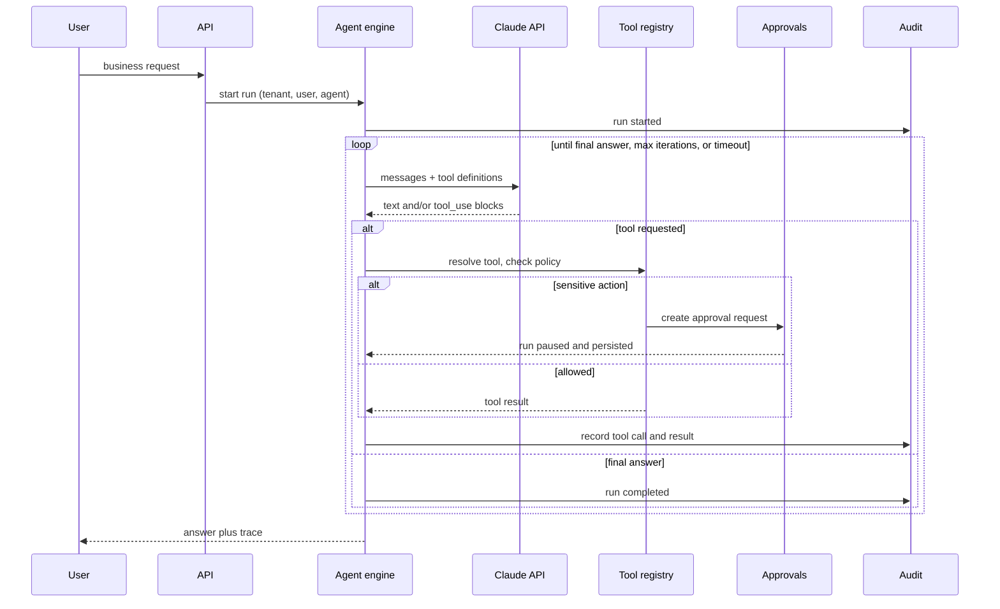

# Architecture

**Status:** most of this is built. Identity and multi-tenancy, the LLM
gateway, agent execution, the tool framework, workflows, approvals, usage and
cost accounting, metrics, tracing and the console are all implemented and
covered by tests. Each section below says which it is.

Retrieval (section 8) is the substantial part that is **not** built: there is a
`documents` table holding metadata and an empty `app/knowledge/` package, and
nothing else. Where this document and the code disagree, the code is right -
please open an issue.

---

## 1. Goals and non-goals

### Goals

1. **Multi-tenant from day one.** Tenant isolation is a property of the data
   access layer, not something bolted on later.
2. **Agents that act, not just chat.** An agent can read business data, search
   documents, call tools, and start workflows.
3. **Safe by default.** Any action that changes state or touches sensitive data
   passes through a policy check and, where required, a human approver.
4. **Fully auditable.** Every agent run, tool call, approval, and state change is
   recorded and replayable.
5. **Maintainable by one developer.** A modular monolith that a newcomer can run
   with `docker compose up`.

### Non-goals

- Microservices. Modules are separated by code boundaries, not network calls.
- Kubernetes or any orchestration beyond Docker Compose.
- Training or hosting models. The platform calls the Claude API.
- Real-time collaborative editing, billing, or a plugin marketplace.

---

## 2. Architectural style

A **modular monolith**: one deployable FastAPI application internally divided
into modules with explicit boundaries.



Everything in that diagram is implemented. There is **no background worker, no
job queue and no embedding service**: a run is advanced by the request that
asked for it, and Redis backs the readiness probe and nothing else. Sections 8
and 14 record what is planned and what it would add.

**Why a monolith.** The hard problems here are tenant isolation, agent
correctness, and auditability — none of which get easier by adding a network
between components. One process means one transaction boundary, one migration
history, and one place to debug. Module boundaries are kept clean so that if a
piece ever needs to be extracted, the seam already exists.

### Layering inside the backend

```
Request
   |
   v
API layer         routers, request/response schemas, HTTP status mapping
   |
   v
Service layer     business logic, orchestration, policy checks, transactions
   |
   v
Repository layer  data access - every query tenant-scoped
   |
   v
Model layer       SQLAlchemy 2.x ORM models
```

Rules:

- Routers contain no business logic; services contain no SQL.
- One area reaches another **through its service only** — never by importing
  its models or querying its tables.
- Pydantic v2 models are the contract at the API edge; SQLAlchemy models never
  leave the service layer.

Section 3 sets out how this maps onto packages.

---

## 3. Code structure

The backend is organised by **layer**, with the domain areas that are more than
a layer given their own package.

```
backend/app/
├── main.py         application factory, middleware, router mounting
├── core/           configuration, database, cache, logging, middleware, errors
├── api/            HTTP layer
│   ├── deps.py     shared dependencies (settings, session, services)
│   ├── health.py   probe endpoints, deliberately unversioned
│   └── v1/         versioned API; endpoints/ holds one module per resource
├── models/         SQLAlchemy models: Base, mixins, one module per aggregate
├── schemas/        Pydantic v2 request/response contracts
├── repositories/   data access; every query goes through one of these
├── services/       business logic, orchestration, policy checks
├── agents/         the tool-use loop, run state, cancellation
├── tools/          the tool registry, the executor, the business tools
├── workflows/      workflow definitions and the state machine
├── observability/  metrics, tracing, the price book, the shared vocabulary
├── demo/           the demo dataset
├── knowledge/      document ingestion and retrieval (RAG)     (not built yet)
└── audit/          append-only audit trail (recorded; no API over it yet)
```

A request moves down the layers and back:

```
api/        routers: validate, call a service, shape the response. No logic.
services/   the business operation. Raises domain errors, never HTTPException.
repositories/ queries. Tenant-scoped, so isolation is enforced in one place.
models/     the tables.
```

Rules that keep the layers from blurring:

- Routers contain no business logic; services contain no SQL.
- Services never import FastAPI. They raise `core.exceptions` errors, which the
  API layer translates — that is what makes a service reusable from a worker or
  an agent tool, not just from HTTP.
- Pydantic schemas are the contract at the edge; SQLAlchemy models never leave
  the service layer.
- A service may call another service. Nothing calls another area's repository.

### Why layer-first rather than a package per domain

Grouping by layer puts the cross-cutting rules where they can be enforced: one
`BaseRepository` is the single place tenant scoping is applied, and one error
hierarchy is the single place failures are defined. The domain areas that carry
real machinery rather than plain CRUD — agents, tools, workflows, knowledge,
audit — get their own package, because their internals are not a layer and do
not belong spread across four of them.

### Dependency direction

```
agents ──┬──> knowledge     (retrieval)
         ├──> tools         (execution)
         ├──> workflows     (start / resume)
         └──> audit         (record everything)

workflows ──> audit
services ──> repositories ──> models
everything ──> core
```

`core` and `audit` are leaves: they depend on nothing above them. Cycles are not
allowed — if two areas need each other, the shared concept belongs in `core/` or
in a third area.

---

## 4. Multi-tenancy

**Status: implemented.**

**Strategy: shared database, shared schema, discriminator column.** Every
tenant-owned table carries a non-null, indexed `organization_id` foreign key.
The tenant is called an *organization* everywhere in the code and the API; this
document uses "tenant" only when describing the general pattern.

This is chosen over schema-per-tenant or database-per-tenant because a single
migration history and connection pool is far simpler to operate, and the
isolation guarantee can be enforced in one place in code.

### Enforcement — defence in depth

1. **Organization resolution (dependency layer).** The optional
   `X-Organization-ID` header names the organization a request acts on, and is
   resolved against the caller's own active memberships in the database on every
   request. It is a *request*, not a grant: naming an organization the caller is
   not an active member of yields `403`, identically to naming one that does not
   exist. With the header absent, a caller belonging to exactly one organization
   acts in it, and a caller belonging to several must send it. The access token
   carries `sub`, `iat` and `exp` only — **no organization claim** — so
   membership can never be asserted by the token alone.

   There is **no JWT-claim and no subdomain tenancy mechanism**: the header is
   the only one, and it is resolved in the dependency layer rather than in
   middleware.
2. **Scoped repositories (primary guard).** `TenantScopedRepository` is the
   single place the `WHERE organization_id = :organization_id` predicate is
   written; modules do not write raw unscoped queries.
3. **Database constraints (backstop).** Tenant-owned rows carry a redundant
   `UNIQUE (id, organization_id)`, and references between them are composite
   foreign keys — so a cross-tenant reference is *unrepresentable* rather than
   merely rejected by application code.
4. **Tests as a guarantee.** A shared test suite asserts, for every tenant-owned
   table, that organization A cannot read or write organization B's rows.

> **PostgreSQL row-level security is not implemented.** It remains the intended
> second database-level layer, but no policy, no session variable and no
> `ENABLE ROW LEVEL SECURITY` statement exists in any migration today. Layers 1
> and 2 are application code; layer 3 is the only database-enforced one, and it
> catches cross-tenant *references* rather than unscoped reads.
> [evaluation.md](evaluation.md#how-tenant-isolation-works) sets out what that
> does and does not buy.

### Keys and indexes

Primary keys are UUIDs. Tenant-owned tables index `organization_id`, and where a
lookup warrants it `(organization_id, <lookup column>)` rather than the lookup
column alone, so the query is index-covered under the tenant filter.

---

## 5. Core data model (sketch)



Conventions on every table: `id` (UUID), `organization_id` where tenant-owned,
`created_at`, `updated_at`. Soft deletes via `deleted_at` where history matters.
Audit rows are append-only — no update, no delete.

---

## 6. Request lifecycle

```
1. Request arrives      ->  request id assigned, structured log opened
2. Auth middleware      ->  JWT verified, user identity loaded
3. Tenant middleware    ->  tenant resolved, membership checked,
                            request-scoped context populated
4. Router               ->  payload validated by a Pydantic model
5. Dependencies         ->  DB session opened, services constructed
6. Service              ->  permission check, business logic, repository calls
7. Repository           ->  tenant-scoped queries
8. Response             ->  ORM objects mapped to response schemas
9. Teardown             ->  transaction committed or rolled back,
                            audit entries flushed, log closed
```

Domain exceptions are translated to HTTP responses in one exception-handler
layer, so services never import `HTTPException`.

---

## 7. Agent execution (implemented)

An agent run is a bounded loop around the Claude API using **Claude tool use**.



Design points:

- **Tool registry.** Tools are declared with a JSON schema, a handler, a
  sensitivity level, and the roles allowed to invoke them. Claude only ever sees
  the tools the current tenant and user are permitted to use.
- **Every run is a database record.** State (`running`, `awaiting_approval`,
  `completed`, `failed`, `cancelled`), message history, and tool calls are
  persisted, so a paused run can resume in a different process.
- **Bounded.** Iteration cap, wall-clock timeout, and token budget per run, all
  configurable per tenant.
- **Business rules.** Tenant-configured rules are enforced in code before a tool
  executes — never left to the model to respect on its own.

---

## 8. Retrieval (RAG - not built)

**None of this section is built.** What exists is a `documents` table holding
metadata and an empty `app/knowledge/` package. There is no upload handling, no
text extraction, no chunking, no embedding, no vector column and no search. The
design below is the intended shape, recorded so the decision is not remade from
scratch — read every sentence of it as *would*, not *does*.

**Ingestion (planned).** Upload → store file → extract text → chunk (size and
overlap from config) → embed each chunk → persist chunk and vector with
`organization_id`. This would need a background job runner, which also does not
exist.

**Query (planned).** Embed the query → vector similarity search in Postgres
(`pgvector`) filtered by `organization_id` → optional keyword/trigram search for
a hybrid result → merge and rank → hand the top chunks to the agent as tool
output, each with a citation back to its source document.

`pgvector` rather than a dedicated vector database, when it is built: one
datastore, one backup, one transaction boundary, and tenant filtering identical
to every other query. The Compose stacks already use the `pgvector` image and
create the extension, so the decision is provisioned — but nothing stores or
queries a vector.

---

## 9. Approvals and workflows (implemented)

**Approvals.** A tool or workflow step marked sensitive creates an approval
request instead of executing. The request records who asked, what action, with
what arguments, and why it was gated. An approver with the right role approves or
rejects; approval resumes the paused run with the original arguments — the
arguments are never re-derived by the model after the fact.

**Workflows.** A workflow is an ordered set of steps (tool call, agent step,
approval gate, or condition) stored as a definition and executed as a durable
state machine. Each step run is persisted, so an execution survives a restart and
can be retried or resumed from its last completed step. There is **no background
worker**: an execution is advanced by the request that asked for it, and one
whose request died is swept and failed rather than silently resumed.

---

## 10. Audit and monitoring (implemented in part)

The audit trail is written and the observability described below is built. What
is **not** built is any way to read the audit trail back: there is no audit
endpoint and no audit screen. Retention by partitioning is design, not code.

**Audit log.** Append-only. Each entry holds tenant, actor (user or agent), the
action, the target entity, before/after state where applicable, a correlation id
linking it to its agent run, and a timestamp. Nothing updates or deletes audit
rows — retention is handled by partitioning, not mutation.

**Run traces.** Per agent run: every iteration, prompt, tool call, latency, token
usage, estimated cost, and final outcome — enough to answer "why did the agent do
that?" after the fact.

**Operational telemetry.** Structured JSON logs carrying request id, tenant id
and user id on every line; health endpoints (`/health` for liveness,
`/health/ready` checking Postgres and Redis); counters and histograms for request
rate, error rate, agent run duration and tool failures.

**No tenant identifier and no execution identifier is ever a metric label or a
span attribute** — a bounded label set with an overflow bucket instead. Per
organization figures are an authenticated, tenant-scoped *usage query*, not a
metric; anyone who can scrape metrics is not thereby entitled to know which
organization is spending the most.

---

## 11. Security

- **Secrets from the environment only.** No credential is committed; `.env` is
  ignored and `.env.example` documents every variable.
- **Authentication.** JWT access tokens, restricted to HMAC algorithms;
  passwords hashed with Argon2id. **There are no refresh tokens and no token
  revocation** — expiry is what ends a session.
- **Authorization.** Role-based within an organization (owner, admin, member),
  checked in the service layer. Membership is verified against the database on
  every request, never trusted from the token alone.
- **Tenant isolation.** Section 4 — scoped repositories, with composite foreign
  keys as the database-level backstop. **Row-level security is not
  implemented.**
- **Input validation.** Pydantic v2 at the boundary; SQLAlchemy parameter binding
  throughout — no string-built SQL.
- **Agent containment.** Tools are an allowlist. The model cannot reach the
  database, the filesystem, or the network except through a registered tool, and
  every tool call is policy-checked and logged.
- **Prompt injection.** Retrieved document content and tool output are treated as
  untrusted data. Permission to act comes from the registry and the policy layer,
  never from instructions found inside content.
- **Transport and limits.** TLS at the edge and CORS restricted to configured
  origins. **There is no rate limiting and there are no quotas** — per-tenant
  limiting in Redis is intended, and nothing bounds what one organization may
  spend today.

---

## 12. Testing

`pytest` throughout, against a real PostgreSQL instance (not SQLite) so that
migrations and constraints behave as they will in production.

- **Unit** — services and pure logic, with repositories faked.
- **Integration** — routers through to the database, per-test transaction
  rollback for isolation.
- **Tenant isolation suite** — cross-tenant access attempts must fail, asserted
  for every tenant-owned table.
- **Agent tests** — the Claude API is stubbed with recorded tool-use responses,
  so the loop, the policy layer and the approval gate are tested
  deterministically.

---

## 13. Deployment

Local development runs either way. `docker compose up` is the reference
environment — Postgres (pgvector image), Redis, the backend and the frontend.
The same code also runs natively against a localhost Postgres, which is what
developers without Docker use; see
[development-windows.md](development-windows.md).

Dependencies are declared as required or optional rather than assumed present.
Connections are lazy, so the application starts with an optional dependency
absent and reports it on `/health/ready` without failing the check. Redis is
optional today because nothing implemented uses it yet; it becomes required as
soon as caching, rate limiting or the job queue lands, which is a one-line
configuration change (`REDIS_REQUIRED`). Postgres is always required.

Schema changes are Alembic migrations applied on start; migrations are
forward-only and reviewed like code.

Production keeps the same shape — the container runs behind a reverse proxy with
TLS, backed by managed Postgres and Redis. Horizontal scaling is more instances
of the same image, which works because the application holds no in-process state:
sessions are stateless JWTs and everything else is in Postgres. Redis holds
nothing today — it answers the readiness probe — so a cache and a queue would be
what it carries once either is built.

---

## 14. Key decisions

| Decision | Choice | Rationale |
| --- | --- | --- |
| Overall style | Modular monolith | One deployable, one transaction boundary; module seams preserved for later extraction |
| Tenant isolation | Shared schema, `organization_id`, composite foreign keys | Simplest to operate; isolation enforced centrally and testable. RLS was intended as a further backstop and is **not implemented** |
| Vector storage *(planned)* | `pgvector` in Postgres | One datastore; tenant filtering identical to every other query. Image and extension are provisioned; **nothing stores or queries a vector** |
| Concurrency | Async SQLAlchemy and async FastAPI | The workload is I/O-bound: database, model provider, external tools |
| Background work *(planned)* | Redis-backed queue | **Not implemented.** There is no worker and no queue; a run is advanced by the request that asked for it |
| API versioning | `/api/v1` from the start | Cheap now, expensive to retrofit |
| Agent safety | Tool registry, policy layer, approvals | Model output is a request to act, never authority to act |
| Audit | Append-only table, no mutation | An audit log that can be edited is not an audit log |

Decisions that change materially as the project grows get an ADR in
[docs/adr/](adr/).

---

## 15. Build order

Phases mirror the roadmap in the [README](../README.md): foundation →
multi-tenancy → identity → business data → documents/RAG → agent core →
approvals → workflows → audit and monitoring → dashboard. Each phase is a
vertical slice that runs and is tested before the next one starts.
